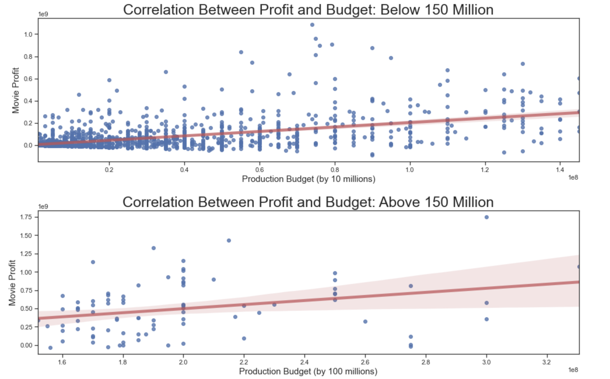
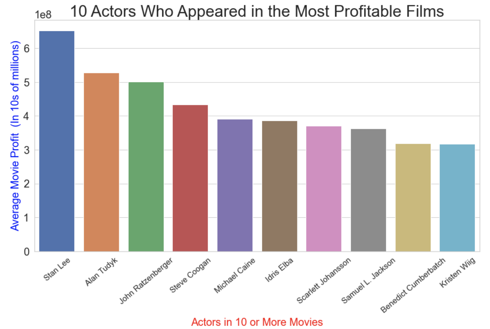
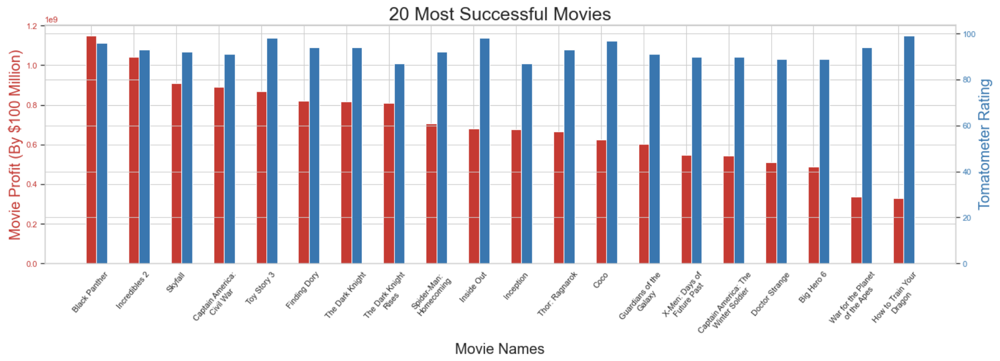
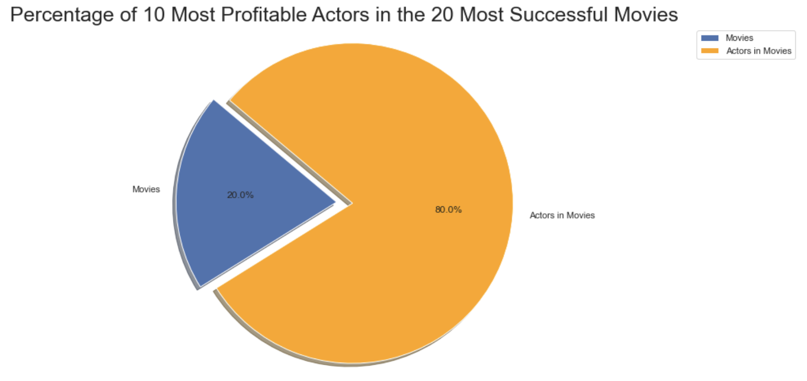

# Microsoft Movie Visualization 

**Authors**: Chandler O'Neal, Jordan Jones

## Overview

The focus of this project was to analyze the current film industry to offer Microsoft Corporation the best approach to compete with their competitors. The project observed 11 tables that contained information on the film industry including movie cost, rating, profit, and actor information. The tables were then consolidated to 4 tables; the four tables contained a total collection of 1,455 movies. This analysis can be useful to the Microsoft Corporation to determine the most profitable solution for allocating their funding had they decided to go into the film industry. 


## After retreiving our information from the tables, we hypothesized that actors / actresses who appeared repeatedly (more that ten times) in the most profitable films would likely appear in the most successful films (films that had a profit at or above 300 million dollars and a tomatometer rating above 85). 


## Business Problem

Microsoft Corporation may be able to focus their funding on hiring actors who have appeared in ten or more of the most profitable films in the industy to improve Microsoft's profitablility and success rate. Microsoft may also be able to improve the profitability of their films by placing a minimum budget of 150 million dollars in order to produce higher quality films. 


## Data

The 11 tables each contained a unique ID that was associated with the movie titles. These data sets contained information about actors, movie budget, gross returns, movie rating, and other film attributes.


## Methods

This project uses discriptive analyses, such as the measure of variability for budget and profitability as well as the tendency for actors in the most profitable films. This provides useful information on the impact on budget as well as actors who have taken part in the most profitable films. 

***
Questions to consider:
* How did you prepare, analyze or model the data?
* Why is this approach appropriate given the data and the business problem?
***

## Results

Budgets above 150 million dollars have a stronger correlation with profit that those below 150 million. 


---
The 10 Actors that appeared in 10 or more of the most profitable films tended to have a mean profit above 30 million.


---

The 20 most successful movies filtered by budget over 150 million dollars, tomatometer rating above 85, and profit above 300 million dollars had a consistent tomatometer status of Certified-Fresh.


---

The 10 actors who appeared in 10 or more of the most profitable films appeared in the most successful 80% of the time. 



***
Questions to consider:
* How do you interpret the results?
* How confident are you that your results would generalize beyond the data you have?
***


## Conclusions

Provide your conclusions about the work you've done, including any limitations or next steps.

***
Questions to consider:
* What would you recommend the business do as a result of this work?
* What are some reasons why your analysis might not fully solve the business problem?
* What else could you do in the future to improve this project?
***

## For More Information

Please review our full analysis in [our Jupyter Notebook](./dsc-phase1-project-template.ipynb) or our [presentation](./DS_Project_Presentation.pdf).

For any additional questions, please contact **name & email, name & email**

## Repository Structure

Describe the structure of your repository and its contents, for example:

```
├── README.md                           <- The top-level README for reviewers of this project
├── dsc-phase1-project-template.ipynb   <- Narrative documentation of analysis in Jupyter notebook
├── DS_Project_Presentation.pdf         <- PDF version of project presentation
├── data                                <- Both sourced externally and generated from code
└── images                              <- Both sourced externally and generated from code
```
